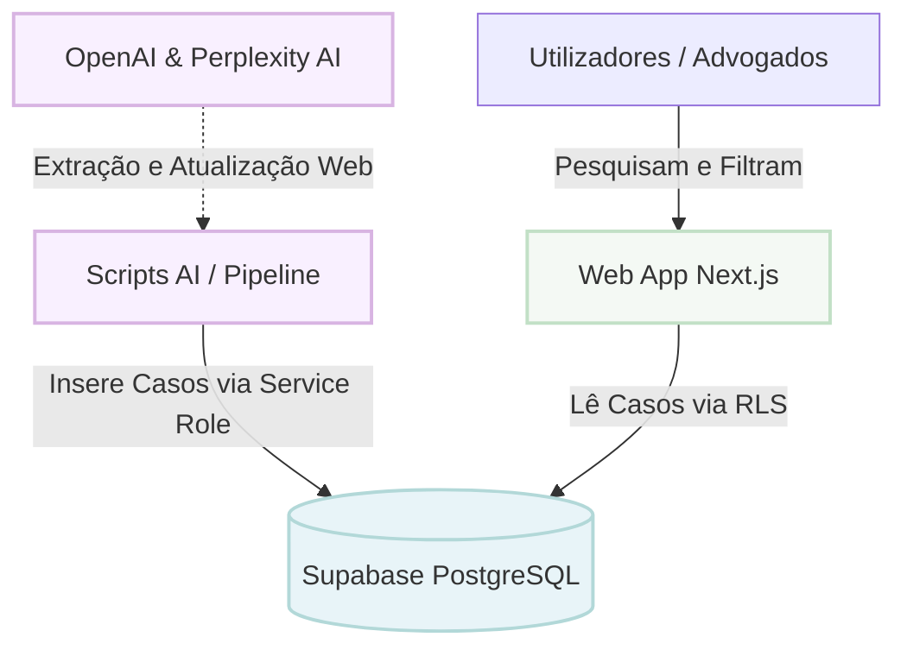

# Documentação: Visão Geral e Arquitetura

Bem-vindo à documentação do **Antitrust Library**. Esta aplicação é uma plataforma baseada em inteligência artificial para recolher, processar, armazenar e consultar informações relativas a casos de direito da concorrência (Antitrust).

O objetivo deste documento é fornecer uma visão geral clara e fácil de entender para quem queira contribuir ou perceber "o que está a acontecer" por trás dos panos.

## Tecnologias Principais

O projeto usa uma stack tecnológica moderna (conhecida como "T3-ish" stack, adaptada):
- **Frontend / Backend**: [Next.js](https://nextjs.org/) (App Router, React 19)
- **Estilização**: Tailwind CSS v4
- **Base de Dados & Autenticação**: [Supabase](https://supabase.com/) (PostgreSQL)
- **Pipelines de IA**: 
  - **OpenAI** (Extração e Estruturação de dados brutos)
  - **Perplexity AI** (Pesquisa em tempo real para atualização do estado dos casos)

## Arquitetura: Como as Peças se Encaixam

A aplicação está dividida em três pilares principais, cuja interação é orquestrada da seguinte forma:

### 1. O Pipeline de Dados (Scripts IA)
Como os dados de processos judiciais ou decisões de autoridades (ex: Comissão Europeia, FTC) são frequentemente não-estruturados (PDFs, notícias, CSVs desorganizados), temos rotinas automatizadas na pasta `src/scripts`:
- **Ingestão**: Pegamos em CSVs ou texto livre e usamos a **OpenAI** para extrair as entidades (empresas, multas, datas) e formatar num objeto JSON consistente.
- **Manutenção**: Periodicamente, usamos o modelo Sonar da **Perplexity AI** (porque tem acesso à internet em tempo real) para verificar se houve recursos, novas multas ou alterações de estado num caso, atualizando o nosso JSON.
- **Exportação**: Um script envia esse JSON final validado diretamente para o Supabase.

### 2. A Base de Dados (Supabase)
O Supabase atua como a nossa fonte de verdade. Utiliza **PostgreSQL** com tabelas relacionais simples mas poderosas:
- Tabela `Cases`: Armazena a informação mestre do caso (título, resumo, multas, tags).
- Tabela `CaseTimelineEvents`: Armazena o histórico do processo (datas e descrições).
- Tabela `Users`: Armazena a informação de metadados dos utilizadores (papel, estado de aprovação).
- **Segurança (RLS - Row Level Security)**: A base de dados garante que apenas utilizadores logados podem consultar dados, e que apenas administradores podem apagar ou inserir novos casos através da interface.

### 3. A Aplicação Web (Next.js)
A interface de utilizador (Interface gráfica) serve para os advogados ou analistas pesquisarem casos. 
- Focada em performance (usando SSR - Server-Side Rendering) e na experiência de pesquisa (`SearchBar`, `CaseCard`).
- Tem um poderoso **fluxo de controlo de acessos**: Não basta criar conta. Quando alguém se regista, fica num estado `Pending` (Pendente). O "middleware" do Next.js interceta as rotas e tranca este utilizador numa sala de espera (`/pending`) até que um Administrador aprove o seu acesso.

---

**Próximos Passos na Documentação:**
- Para entender o modelo de dados: [Base de Dados e Segurança](./02-base-de-dados.md)
- Para rodar ou entender os scripts: [Pipeline de Dados e IA](./03-pipeline-de-dados-ia.md)
- Para navegar pelo código Next.js: [Frontend e Autenticação](./04-frontend-e-autenticacao.md)
