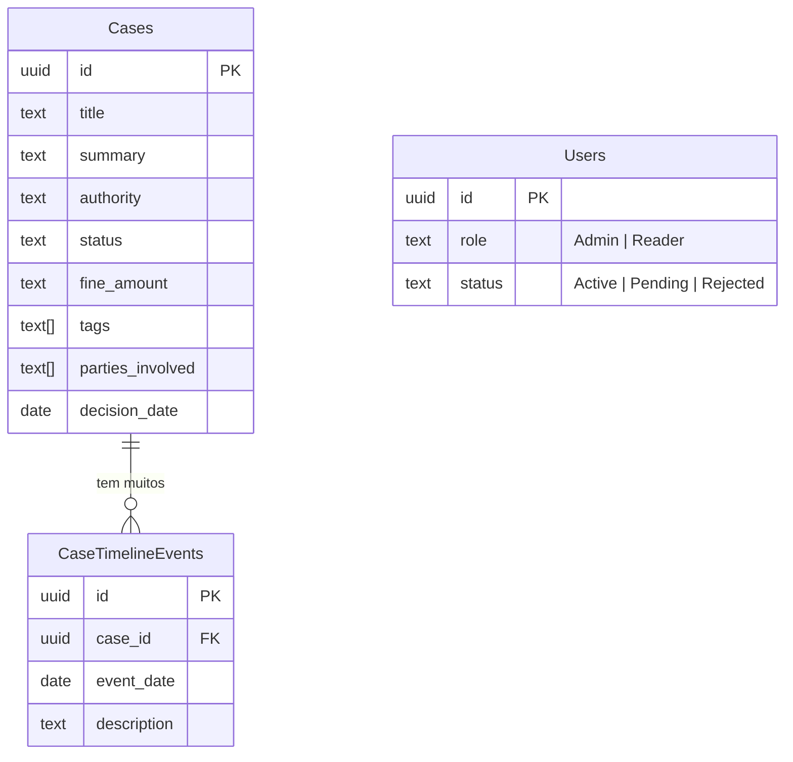

# Documentação: Base de Dados e Segurança (Supabase)

O coração do Antitrust Library é o **Supabase** (PostgreSQL). Toda a lógica de quem pode ver o quê ("Autorização") está implementada diretamente na camada da base de dados, garantindo que mesmo que o Frontend falhe ou a API seja acedida diretamente, os dados estão protegidos.

## 1. Esquema Relacional

O esquema atual (encontrado em `supabase_schema_fase5.sql`) implementa as seguintes tabelas chave. Abaixo está a representação visual das relações:



### Tabela `Cases`
Guarda os detalhes fundamentais de um processo antitrust.
- `id` (UUID): Identificador único.
- `title`, `summary`: Texto base extraído pela IA.
- `authority`: Entidade reguladora (ex: EC, CMA, FTC).
- `status`: Estado atual (ex: Open, Closed, Blocked).
- `fine_amount` (Text): O valor da multa. É em texto (ex: "€2.4 Billion") porque a IA extrai a formatação humana exata.
- Arrays importantes: 
  - `tags` (ex: ["Cartel", "Tech"])
  - `parties_involved` (ex: ["Google", "Microsoft"])
  - `links` (URLs de fontes)

### Tabela `CaseTimelineEvents`
Muitos casos duram anos (investigação > decisão inicial > recurso > decisão final). Esta tabela tem uma relação (foreign key) com `Cases`.
- `case_id`: Relaciona ao caso respetivo.
- `event_date`: Data do evento.
- `description`: O que aconteceu neste momento.

### Tabela `Users`
Apesar de o Supabase gerir a Autenticação (`auth.users`), nós mantemos uma tabela pública de perfis de utilizador sincronizada, para podermos adicionar os nossos próprios metadados:
- `id`: O mesmo UUID da conta de autenticação.
- `role`: `Admin` ou `Reader`.
- `status`: `Active`, `Pending` (crucial para o sistema de sala de espera), ou `Rejected`.

## 2. Row Level Security (RLS)

O RLS é como ter um segurança na porta de cada linha da tabela. As "Policies" definem quem pode ler, inserir ou modificar registos.

**Exemplo Prático na tabela *Cases*:**
1. **SELECT (Leitura)**: Permitida a qualquer perfil `authenticated` (desde que tenha feito login).
   ```sql
   CREATE POLICY "Authenticated users can select Cases"
     ON public."Cases" FOR SELECT
     USING ( auth.role() = 'authenticated' );
   ```
2. **ALL (Modificação, Inserção, Apagar)**: Permitida apenas a quem tem a *role* de Admin.
   ```sql
   CREATE POLICY "Admins have full access to Cases"
     ON public."Cases" FOR ALL
     USING ( EXISTS (
       SELECT 1 FROM public."Users" WHERE "Users".id = auth.uid() AND "Users".role = 'Admin'
     ) );
   ```

### Porque é que o script da IA consegue gravar dados?
Os scripts node.js em `src/scripts/` (como o `import-to-supabase.ts`) ligam-se à base de dados usando a `SUPABASE_SERVICE_ROLE_KEY`. Esta chave é secreta (nunca exposta ao frontend) e tem a capacidade técnica de ultrapassar globalmente (bypass) o RLS. Assim, o script pode inserir milhares de casos sem pertencer a um "utilizador Admin" humano.
