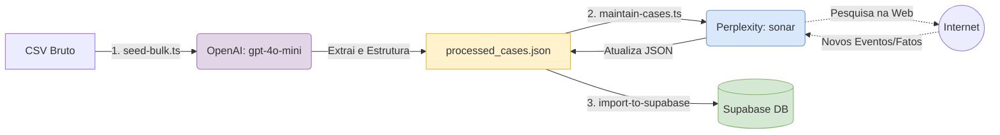

# Documentação: Pipeline de Dados & IA

O grande diferencial deste projeto é como os dados legais (difíceis de estruturar) são processados automaticamente por Modelos de Linguagem (LLMs).

Todos os scripts relevantes estão localizados na diretoria `src/scripts/`.

### O Fluxo de Dados (Data Ingestion & AI)



## 1. `seed-bulk.ts`: O Início (Extração e Estruturação)

**Objetivo:** Pegar em ficheiros CSV estáticos (`data/sample-cases.csv`) e transformá-los em JSONs exatos que cumprem o nosso esquema da base de dados.

**Como funciona:**
1. O script lê as linhas do CSV através da biblioteca `PapaParse`.
2. Para cada linha de dados sujos ou amorfos, o script faz uma chamada à API da **OpenAI (`gpt-4o-mini`)**. 
3. O *System Prompt* (a instrução dada à IA) diz à OpenAI que é um "assistente legal especialista em antitrust" e força-a a cuspir **apenas** um objeto JSON válido contendo os campos: `title`, `summary`, `authority`, `status`, `industry`, `tags`, `parties_involved`, `fine_amount`, `decision_date`, `links` e `timeline_events`.
4. O resultado formatado é gravado sequencialmente em `data/processed_cases.json`.

*(Existe também um `test-ai.ts` que faz o mesmo, mas para pesquisar casos únicos como "Microsoft Activision CMA", apenas a título de teste interativo e testes no desenvolvimento).*

## 2. `maintain-cases.ts`: A Atualização em Tempo Real (Web Search)

**Objetivo:** Processos antitrust podem arrastar-se na justiça por anos. Como manter os dados atualizados?

**Como funciona:**
1. Lê todos os casos atualmente existentes no nosso `processed_cases.json`.
2. Usa a API da **Perplexity AI (modelo `sonar`)**. A escolha da Perplexity é intencional: eles têm agentes que navegam ativamente na web na hora da pesquisa.
3. A instrução diz: *"Isto é o que eu tenho sobre este caso até data X. Procura na web se houve alguma novidade depois dessa data. Responde com um JSON indicando se tem atualizações (`has_updates`), qual o novo status, nova multa, e novos eventos cronológicos."*
4. Se a IA encontrar novidades relevantes e credíveis suportadas por links, o nosso script atualiza o ficheiro `processed_cases.json`.

## 3. `import-to-supabase.ts`: O Carregamento Final (Bulk Insert)

**Objetivo:** Pegar no `processed_cases.json` limpo e atualizado, e carregá-lo para a base de dados de produção.

**Como funciona:**
1. Liga-se ao Supabase através da `SUPABASE_SERVICE_ROLE_KEY`. Isso permite ultrapassar os bloqueios de segurança (RLS - ver Documentação 02) que normalmente só deixariam Administradores Humanos pelo Browser criar casos.
2. Por cada caso no ficheiro:
   - Primeiro insere na tabela mestre `Cases` e obtém o identificador gerado (`UUID`).
   - Se o caso possuir `timeline_events` (eventos ao longo do tempo), usa esse UUID mestre e insere em bloco várias linhas na tabela associada `CaseTimelineEvents`.

### Variáveis de Ambiente Necessárias (`.env.local`):
Para rodar este pipeline, é imperativo ter definido:
```env
OPENAI_API_KEY="..."
PERPLEXITY_API_KEY="..."
NEXT_PUBLIC_SUPABASE_URL="..."
SUPABASE_SERVICE_ROLE_KEY="..."
```
