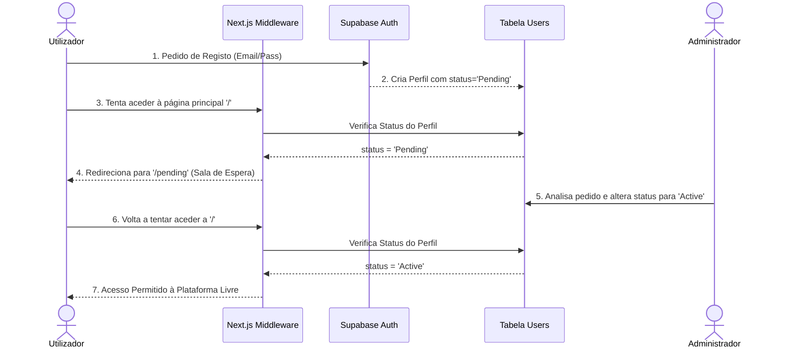

# Documentação: Frontend e Autenticação

A aplicação web é o ponto de contacto para os utilizadores consultarem a livraria judicial. Foi construída com **Next.js** usando o recém-lançado `App Router` e renderização no lado do servidor (`SSR`), acoplado à estilização rápida via `Tailwind CSS`.

## 1. Autenticação e Autorização (O Fluxo de Controlo de Acesso)

Este projeto tem um requisito de segurança sofisticado: Não basta fazer registo para entrar. Uma conta tem de ser validada manualmente.

### Fluxograma do Ciclo de Aprovação

### O Arquivo Central: `src/middleware.ts` 
(o gatekeeper do Next.js)
Sempre que o browser pede uma página à aplicação, o Middleware corre primeiro (com lógica escrita em `src/utils/supabase/middleware.ts`). Este ficheiro verifica:
1. **O utilizador tem sessão de Login iniciada?**
   - Não =  Envia o browser em peso para `/login`.
2. **O utilizador tem sessão de Login, mas o seu Perfil na base de dados (`Users.status`) diz "Pending" (Pendente)?**
   - Sim = Fecha o utilizador na sala de espera: o URL `/pending`. Não consegue navegar para mais lado nenhum.
3. **Se o Utilizador está Aprovado/Ativo**, deixa-o seguir para a página `/` e pesquisar os dados.

### Como a conta nova vai parar ao estado de "Pendente" (`/login/actions.ts`)
Quando um utilizador novo se tenta registar:
1. Em vez de criar um utilizador base normal do Supabase, o sistema usa as credenciais de interface `createAdminClient` para "burlar" as regras e forçar a criação como se fosse administrador de sistema (`email_confirm: true`).
2. Introduz um registo na tabela pública `Users` marcando esse ID com as chancelas: `role: 'Reader'` e `status: 'Pending'`.
3. Faz auto-login no browser. O Middleware vê que a sessão acordou, repara no status de "Pending" e manda-o para o `/pending` (Sala de Espera).

*(Isto bloqueia o utilizador, cabendo ao dashboard em `/admin` - idealmente restrito - permitir a quem gere a base de dados mudar o status do utilizador de Pending para Active).*

## 2. A Experiência do Utilizador (Frontend)

Com a arquitetura assente, como navegam os utilizadores depois de aprovados?

### A Página Principal (`src/app/page.tsx`)
Aplica a arquitetura `React Suspense` para renderização progressiva. A barra de pesquisas carrega imediatamente enquanto a pesquisa complexa (que usa a query à BD) corre por trás dos panos.

### Lógica de Filtragem e Procura (`src/app/actions.ts`)
O ficheiro encapsula os *Server Actions*. O método `getCases(...)` expõe os filtros na UI (setor, autoridade europeia vs americana, pesquisas de texto integral) da seguinte forma:
- **Full Text Search**: Cria um construtor de query `.or('title.ilike.%TEXT%,summary.ilike.%TEXT%')` no Supabase para varrer resumos massivos e títulos pelos termos passados.
- **Overlaps / Interseções Array**: Se o utilizador clicar na caixa de "Setores Tecnológicos", como o modelo guarda as tags do AI num array de strings, o Supabase usa `.overlaps('sector', ['Tecnologia'])` de forma veloz para devolver qualquer caso que obedeça.

### Componentes chave:
- `SearchBar.tsx`: Captura inputs de teclado do utilizador e manipula os URL *searchParams* (o que permite copiar o link com os filtros todos e mandar a um colega).
- `CaseCard.tsx`: Recebe a interface `CaseMatch` e exibe visualmente (usando labels do Tailwind) os intervenientes, autoridade, multa e respetivas tags.
- `Sidebar.tsx`: Elemento persistente para a navegação ou definição dos botões globais.
